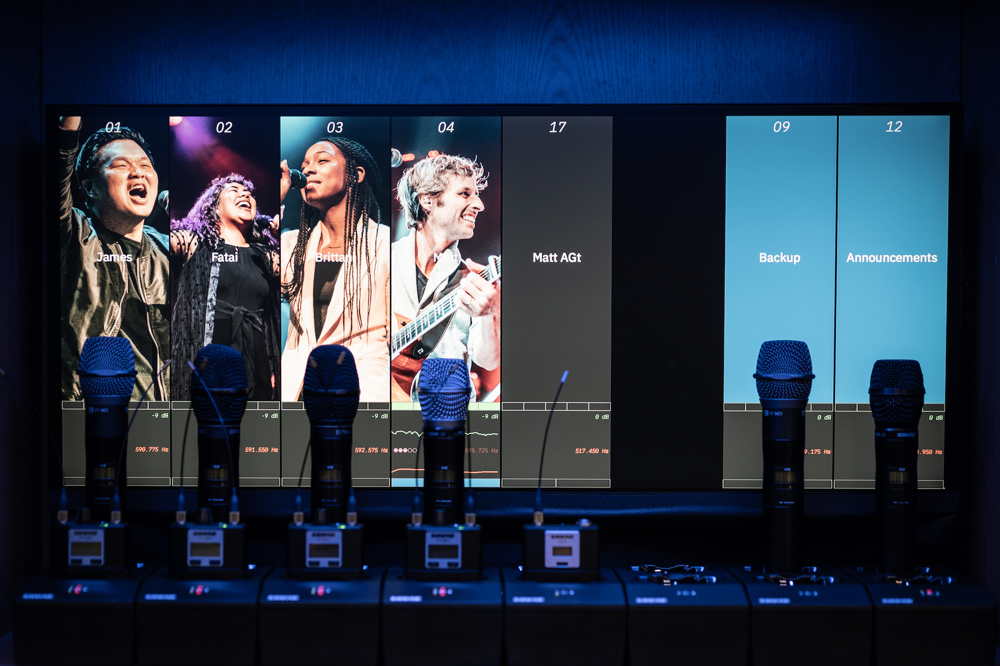
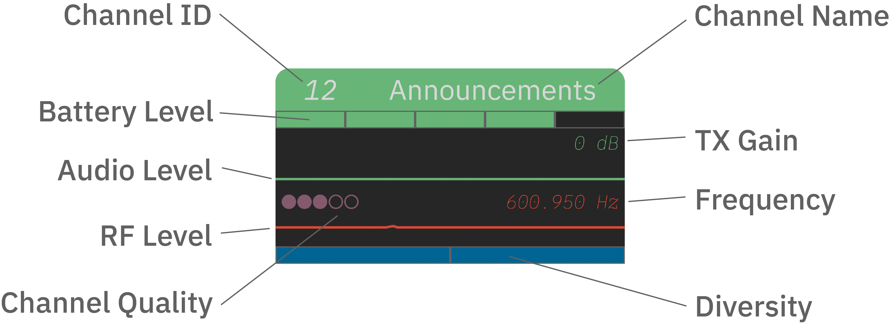
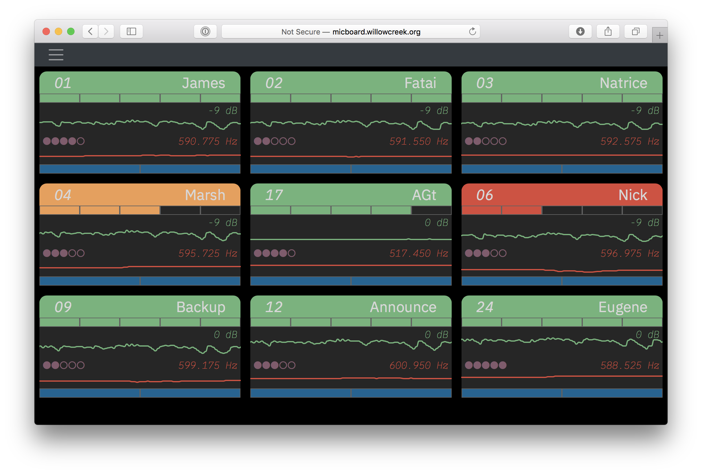
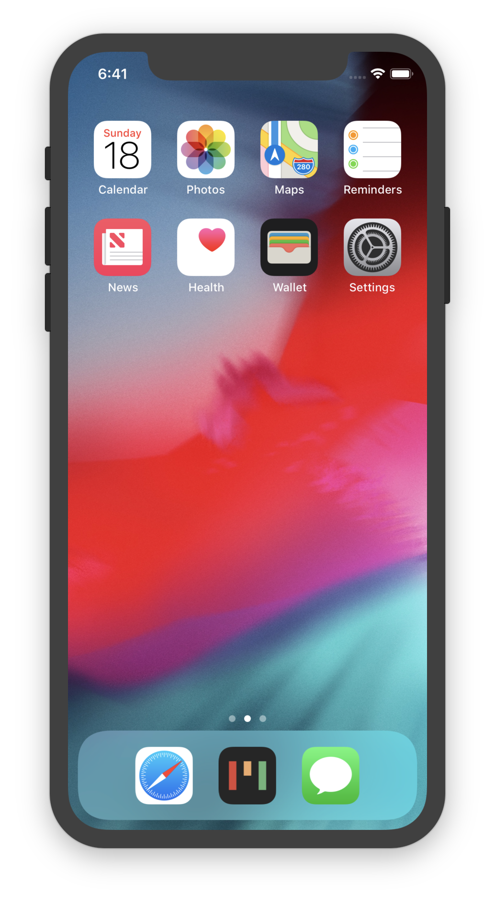
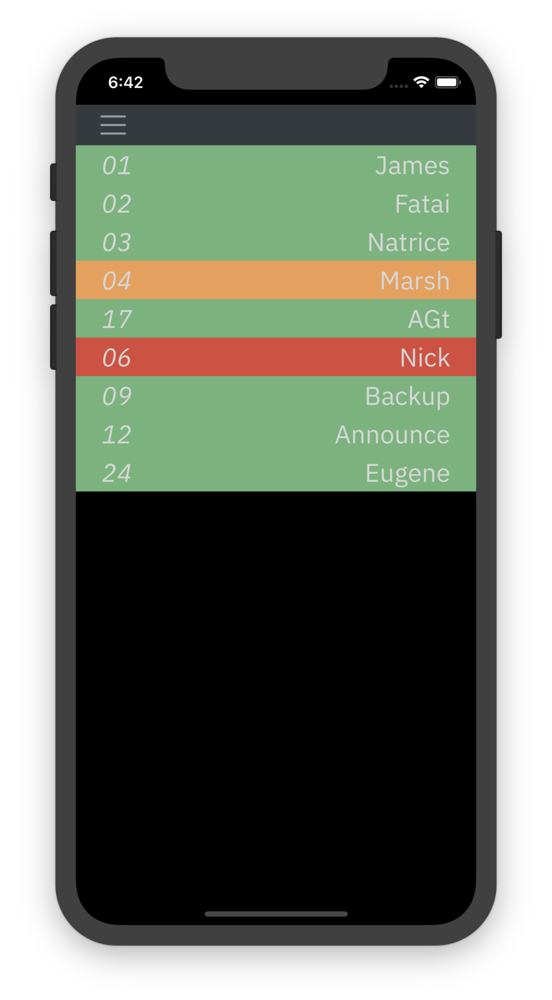
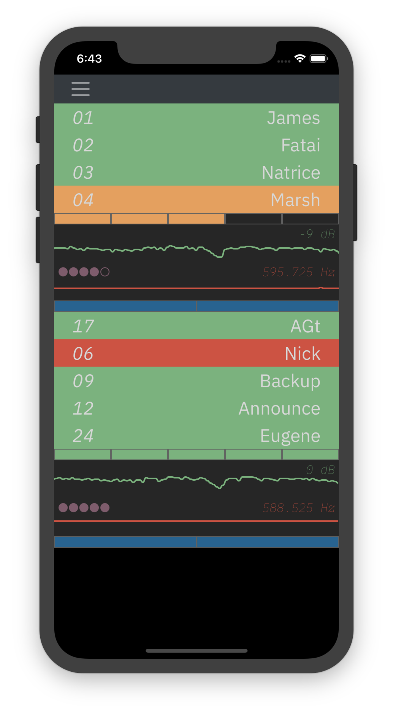
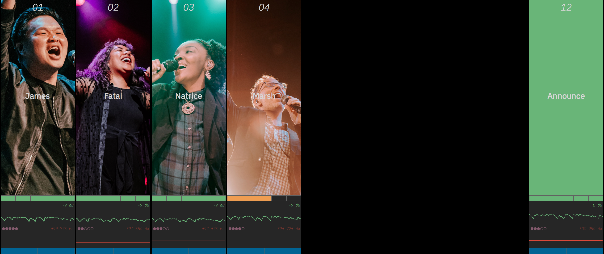

<p align="center">
  <a href="https://micboard.io"></a>
</p>

<h1 align="center">Micboard</h1>

> **Community-maintained fork.** This is a modernized fork of
> [karlcswanson/micboard](https://github.com/karlcswanson/micboard), which has not
> been updated since 2019 and no longer builds on current Node.js / Python.
> This fork updates the toolchain and fixes several runtime bugs so Micboard
> installs and runs again. See [What changed in this fork](#what-changed-in-this-fork).

A visual monitoring tool for network enabled Shure devices.  Micboard simplifies microphone monitoring and storage for artists, engineers, and volunteers.  View battery, audio, and RF levels from any device on the network.






## Screenshots
#### Desktop



#### Mobile
<p align="center">
  
</p>

#### Mic Storage


## Compatible Devices
Micboard supports the following devices -
* Shure UHF-R
* Shure QLX-D<sup>[1](#qlxd)</sup>
* Shure ULX-D
* Shure Axient Digital
* Shure PSM 1000

Micboard uses IP addresses to connect to RF devices.  RF devices can be addressed through static or reserved IPs.  They just need to be consistent.


## Documentation
* [Installation](docs/installation.md)
* [Configuration](docs/configuration.md)
* [Micboard MultiVenue](docs/multivenue.md)

#### Developer Info
* [Building the Electron wrapper for macOS](docs/electron.md)
* [Extending micboard using the API](docs/api.md)


## Quick start
Requires Node.js 18+ (20 LTS recommended) and Python 3.9+.
```
git clone https://github.com/creativedamage/micboard.git
cd micboard
npm install
npm run build
python3 -m venv .venv && .venv/bin/pip install -r py/requirements.txt
.venv/bin/python py/micboard.py
```
Then open http://localhost:8058. Or with Docker: `docker compose up -d --build`.

## What changed in this fork
**Build / tooling**
* Replaced `node-sass` (deprecated; fails to compile on Node 16+) with Dart Sass (`sass`).
* Webpack 4 → 5 (Webpack 4 crashes on Node 17+ with `ERR_OSSL_EVP_UNSUPPORTED`); `file-loader` replaced with asset modules; production builds are minified.
* Babel, loaders, jQuery, Bootstrap 4.6, Draggable, QR code and Smoothie charts updated; build tools moved to `devDependencies`; `package-lock.json` committed for reproducible installs.
* Dockerfile rewritten as a multi-stage build (Node 20 → Python 3.12 slim) — the old one used the dead NodeSource `setup_10.x` script. Compose uses host networking so discovery works.
* Docs updated for Node 20 and Python virtualenvs (PEP 668 blocks system `pip install` on current Debian/Ubuntu/Raspberry Pi OS).
* Electron: replaced removed `shell.openItem` API.

**Server fixes**
* Tornado pinned to 6.x; `logging.handlers` imported explicitly (startup previously depended on import side-effects).
* Ctrl+C / `systemctl stop` now actually stop the server (worker threads are daemons); the process exits if the web server fails to bind (e.g. port in use) instead of hanging.
* QR code / URL shows the real LAN IP instead of `127.0.1.1` on Debian-based systems, and honors `-p`/`MICBOARD_PORT`.
* Device discovery no longer crashes on Windows or when the multicast port is busy; unknown models are ignored.
* Receiver socket handling: no crash when a receiver is unreachable at startup, when a TCP peer closes, or when a receiver error occurs mid-loop (one bad receiver no longer starves the others).
* Blank channel names no longer crash the JSON API; unknown channels/slots are ignored safely.
* WebSocket broadcast no longer errors when clients disconnect mid-broadcast.
* API endpoints return HTTP 400 on malformed JSON; config file writes are atomic; repeated reconfig no longer duplicates log output.

## Known Issues
<a name="qlxd">1</a>: [QLX-D Firmware](docs/qlxd.md)
